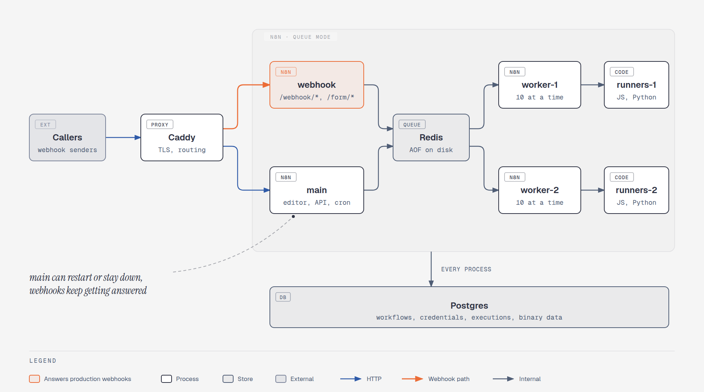
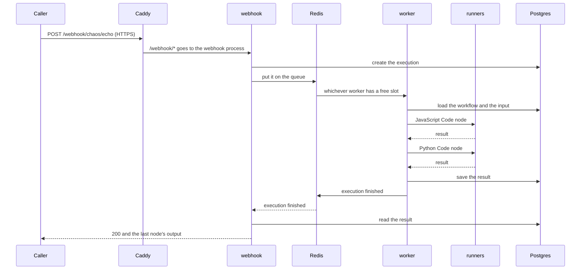
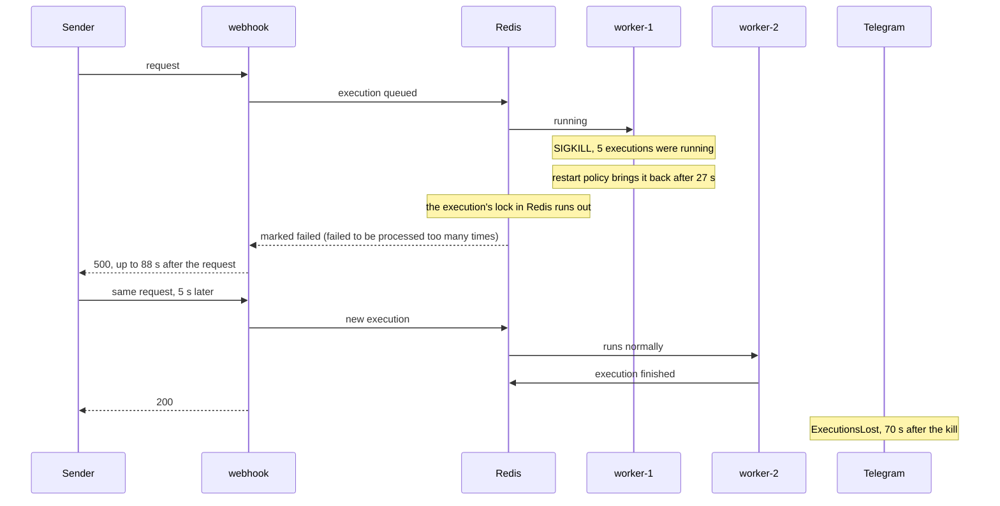
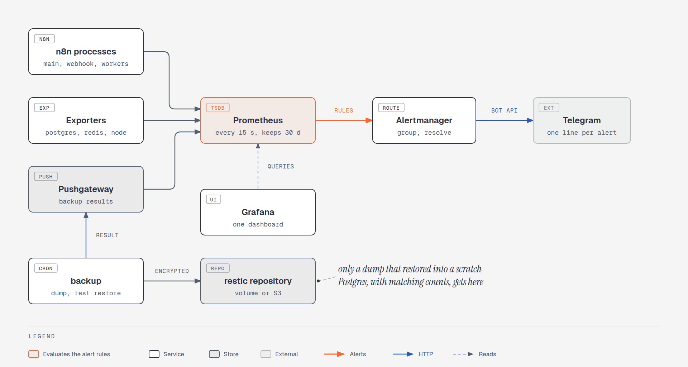
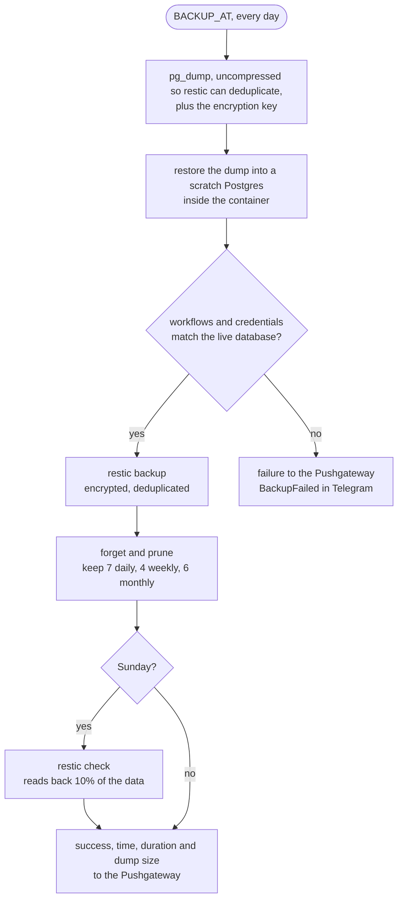
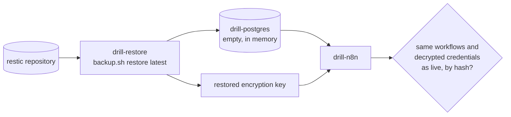
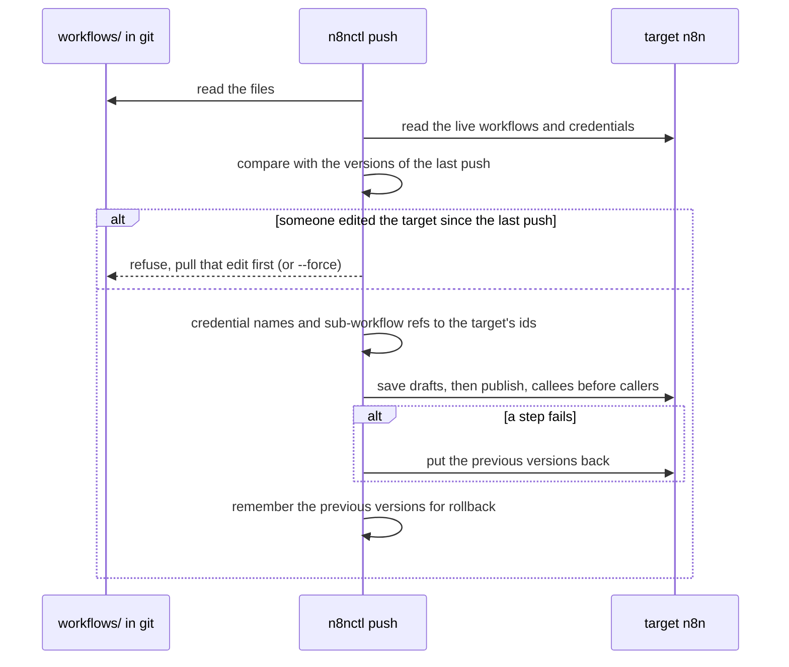

# Production n8n on one machine

Self-hosted n8n that keeps working when its parts fail, says so in Telegram when they do, and can be rebuilt from
its backups. One `docker compose up`: queue mode with separate webhook and worker processes, Code nodes in their own
containers, Postgres, Redis, TLS, Prometheus, Grafana, and nightly backups that are restored before they count.

The default install is one process: the editor, the webhooks, the schedules and every execution share it. A slow
workflow delays the webhooks, a restart drops requests, and the first sign of trouble is a client asking why
nothing happened. This setup splits those jobs apart, watches each of them, and was tested by breaking them.

- **Webhooks keep being answered** while the editor process restarts, is upgraded or is down.
- **Executions run on two workers**, 10 at a time each, and a deploy or a worker restart costs no requests.
- **Code nodes run in separate containers** that have no access to the database password or the encryption key.
- **Every failure that matters reaches Telegram**: a process down, a lost execution, a growing queue, a full disk,
  a failed or missing backup.
- **Backups are tested every night** by restoring them, and a full restore drill is part of the test run.

*Developed in a private repository and published here as a snapshot, so the history starts at publication.*

## Contents

- [Proof](#proof)
- [How it works](#how-it-works): [processes](#processes), [a request end to end](#a-request-end-to-end),
  [crashes](#crashes), [secrets and TLS](#secrets-and-tls), [monitoring](#monitoring), [backups](#backups),
  [restore drill](#restore-drill), [deploys](#deploys)
- [Run it](#run-it)
- [Configuration](#configuration)
- [Going live](#going-live)
- [Operations](#operations)
- [Limits](#limits)
- [Commercial support & migration](#commercial-support--migration)
- [Files](#files)

## Proof

`tools/chaos.py` sends requests through Caddy to a test workflow: a webhook, a JavaScript Code node and a Python
Code node. So each request crosses the queue, a worker and both of its runners, and each answer is checked. Then it
breaks the stack's parts one at a time under that load. When a request fails, the sender sends it again after
5 seconds, as Stripe and most webhook senders would. For the run, Alertmanager's Telegram messages go to a stand-in
that records them. One full run on a laptop (8 cores, 11 GB, a desktop session running alongside):

| Fault | Result |
|---|---|
| None: 20 requests at once | 2021 requests, 6.6 per second, p50 3.0 s, p95 3.5 s, with the laptop's CPU at 100%. One Python task failed to start (HTTP 500) and got through when it was sent again |
| None: one request at a time | p50 393 ms, p95 420 ms |
| `worker-1` restarted | 157 requests, none failed. worker-2 took the new executions, and worker-1 was back after 26 s |
| `worker-1` killed (SIGKILL) | its 5 running executions were lost. Their senders got a 500 after up to 88 s, and all 5 got through when sent again. `ExecutionsLost` reached Telegram after 70 s; the worker was back after 27 s |
| `main` stopped for 2 minutes | 675 webhooks answered, none failed. `TargetDown` reached Telegram after 109 s, and the resolve message followed once `main` was back |
| Redis restarted | back after 6.7 s. 10 executions succeeded, but their senders had no answer within 120 s; sent again, they got through and ran a second time. No execution failed |
| Postgres restarted | back after 6.4 s. 1 request got a 500 and 9 no answer within 120 s; all got through when sent again. One execution stayed "running" in the list |
| Deploy: version 2 pushed with n8nctl, then rolled back | version 2 answered 1.9 s after the push, version 1 1.4 s after the rollback. None of the 93 requests failed, and the live workflow matched git afterwards |
| Restore drill | backup in 10.3 s, restore into an empty Postgres and read in 18.4 s. The restored workflows and decrypted credentials match the live ones by hash |

So a restart that is part of normal work (a worker, `main`, a deploy) costs no requests. A crash or a restart of
Redis or Postgres does cost some, and the sender has to send again: the [limits](#limits) say what else it costs.

**Why one test workflow.** The stack is the product here, and it runs whatever workflows you put on it. The test
workflow, `workflows/chaos-echo.json`, is built to touch every hop a real execution takes: the webhook process, the
queue, a worker, the JavaScript runner and the Python runner. It answers with values computed from the request, so
a wrong or stale answer is caught, not only a missing one. Its optional `sleep_ms` keeps executions running long
enough for a kill to land in the middle of them. For real workflows that run on n8n like this, see the
[Stripe → Xero sync](https://github.com/nightloom-dev/n8n-stripe-xero).

## How it works

<picture>
  <source media="(prefers-color-scheme: dark)" srcset="docs/architecture-dark.png">
  
</picture>

### Processes

**Three kinds of n8n process.** `main` serves the editor and the API and fires schedules and the other triggers.
`webhook` answers production webhooks and forms: Caddy sends `/webhook/*` and `/form/*` there, so requests keep
being answered while `main` restarts or is down. Neither runs workflows. They put executions on the Redis queue,
and `worker-1` and `worker-2` run them, 10 at a time each (`WORKER_CONCURRENCY`). Manual runs from the editor go to
the workers too, so a heavy test does not slow the editor down.

**Code nodes in their own containers.** Each worker hands its Code nodes to a runners container (`n8nio/runners`,
the same version) over a token-authenticated connection. Code there cannot read the worker's files or environment:
the database password and the encryption key the credentials depend on are not in that container. A Code node gets
5 minutes (`N8N_RUNNERS_TASK_TIMEOUT`).

**Queue.** Redis writes the queue to disk every second (AOF), so queued executions survive a Redis restart.
Binary data (files the workflows handle) goes into Postgres, which is n8n's default in queue mode: every process
can read it, and the backups include it.

The 17 services and what each one is for:

| Service | Image | Does | Reachable at | Health check |
|---|---|---|---|---|
| `caddy` | `caddy:2.11.4-alpine` | TLS, routes webhooks to `webhook`, the rest to `main` | `HTTPS_PUBLISH`, `HTTP_PUBLISH` | |
| `main` | `n8nio/n8n:2.40.7` | editor, API, schedules and other triggers, database migrations | through Caddy | `/healthz/readiness`, every 10 s |
| `webhook` | `n8nio/n8n:2.40.7` | production webhooks and forms | through Caddy | same |
| `worker-1`, `worker-2` | `n8nio/n8n:2.40.7` | run executions, `WORKER_CONCURRENCY` each | internal | same |
| `runners-1`, `runners-2` | `n8nio/runners:2.40.7` | JavaScript and Python Code nodes of one worker | internal | |
| `postgres` | `postgres:17.11-alpine` | workflows, credentials, executions, binary data | internal | `pg_isready`, every 5 s |
| `redis` | `redis:7.4.11-alpine` | the execution queue, AOF on | internal | `PING`, every 5 s |
| `backup` | built from `backup/` | nightly dump, test restore, restic, metrics | internal | |
| `prometheus` | `prom/prometheus:v3.15.0` | scrapes every 15 s, keeps 30 days, evaluates the alert rules | `127.0.0.1:9090` | |
| `alertmanager` | `prom/alertmanager:v0.34.1` | groups alerts and sends them to Telegram | `127.0.0.1:9093` | |
| `pushgateway` | `prom/pushgateway:v1.11.3` | keeps the backup results for Prometheus | internal | |
| `grafana` | `grafana/grafana:12.4.11` | the dashboard | `127.0.0.1:3000` | |
| `postgres-exporter` | `prometheuscommunity/postgres-exporter:v0.20.1` | Postgres metrics, and failed and lost executions from n8n's tables | internal | |
| `redis-exporter` | `oliver006/redis_exporter:v1.92.0` | Redis metrics | internal | |
| `node-exporter` | `prom/node-exporter:v1.12.1` | CPU, memory and disk of the host | internal | |

`webhook` and the workers start only after `main` is healthy, because `main` runs the database migrations. Each
n8n process gets 45 seconds to stop (`stop_grace_period`), since n8n waits up to 30 seconds for running executions.
Every service logs to Docker's json-file driver, 3 files of 10 MB. Three more services (`drill-postgres`,
`drill-restore`, `drill-n8n`) exist only under `--profile drill`, for the [restore drill](#restore-drill).

### A request end to end



Each hop is a place where something can fail, and the [chaos run](#proof) breaks them one at a time. The `main`
process is not on this path at all, which is why stopping it costs no webhooks.

### Crashes

A worker that is stopped (a deploy, `docker compose restart`) takes no new executions and finishes the running
ones, for up to 30 seconds; `stop_grace_period` gives it that time. A worker that is killed (out of memory,
SIGKILL) loses the executions it was running:



n8n does not run a lost execution again, and its input is gone, so the Retry button in Executions does nothing for
it. A sender that retries, as Stripe does, gets its request through on the next try. The restart policy brings the
worker back, and the `ExecutionsLost` alert reports every loss.

### Secrets and TLS

`tools/setup.py` generates the secrets into `secrets/` (mode 700, never committed). They reach the containers as
Docker secrets and are read from files (`*_FILE` variables), so `docker inspect` does not show them, and each
container gets only the ones it needs:

| File | Used by |
|---|---|
| `postgres_password` | Postgres, the n8n processes, the backup, postgres-exporter |
| `n8n_encryption_key` | the n8n processes (it encrypts the stored credentials), the backup |
| `runners_auth_token` | the n8n processes and the runners, so only they can talk to each other |
| `restic_password` | the backup. Without it the backups cannot be read |
| `grafana_admin_password` | Grafana |
| `telegram_bot_token` | Alertmanager. `setup.py` writes a placeholder, put the real token there |
| `owner_password` | written by `setup.py`: the n8n owner's login |

The one exception is the S3 keys for offsite backups, which live in `.env` (mode 600).

Caddy gets a Let's Encrypt certificate for a public `SITE_ADDRESS`. For `localhost` it uses its own certificate
authority, and `setup.py` gives its root certificate to n8nctl, so no tool runs with verification off. It routes
by path:

| Path | Goes to |
|---|---|
| `/webhook/*`, `/webhook-waiting/*`, `/form/*`, `/form-waiting/*`, `/mcp/*` | `webhook` |
| `/metrics*` | 404: n8n serves metrics without auth, Prometheus reads them inside the Docker network |
| everything else | `main` |

### Monitoring

<picture>
  <source media="(prefers-color-scheme: dark)" srcset="docs/monitoring-dark.png">
  
</picture>

Every 15 seconds Prometheus scrapes each n8n process, Postgres, Redis, the host and the backup results, and it
keeps 30 days. The alert rules go through Alertmanager to Telegram, one line per alert, and one more line when it
resolves:

```
FIRING TargetDown main:5678: n8n does not answer
RESOLVED TargetDown main:5678: n8n does not answer
```

| Alert | Fires when |
|---|---|
| `TargetDown` | an n8n process, an exporter or a monitoring service has not answered for 1 minute |
| `QueueBacklog` | more than 20 executions have waited for a worker for 5 minutes |
| `ExecutionsLost` | in the last 15 minutes a worker died while running executions, or could not save how they ended |
| `ExecutionErrors` | at least 5 executions failed in the last 15 minutes, and they were over 10% of all |
| `PostgresDown`, `RedisDown` | the exporter has not reached it for 1 minute |
| `DiskSpaceLow` | less than 10% of `/` has been free for 10 minutes |
| `BackupFailed` | the last backup failed |
| `BackupMissing` | no backup has succeeded for 26 hours |

Alertmanager groups alerts by name, waits 30 seconds before the first message so a burst becomes one message, and
repeats an alert that is still firing every 4 hours.

**Lost executions are counted in the database.** n8n's own metrics miss the executions a dead worker lost, so
`prometheus/postgres-queries.yml` gives postgres-exporter one more query. It counts, over the last 15 minutes, the
executions that finished, the ones that failed or crashed, and the ones lost by a worker, which n8n marks with
"failed to be processed too many times". `ExecutionsLost` and `ExecutionErrors` keep firing for 2 minutes after
these numbers disappear, so a Postgres restart, when the exporter cannot read them, does not look like a resolve.

**Grafana** opens on a provisioned dashboard: n8n processes down, executions waiting for a worker, running, failed
and lost in the last 15 minutes, age of the last backup; then executions per minute by outcome, p50 and p95 run
time, the queue, event-loop lag, memory and CPU per process, database size and connections, Redis memory, free disk
and the scrape targets.

### Backups

Every night at `BACKUP_AT` (time zone `TZ`) the backup container runs `backup.sh run`:



The key goes with the dump because without it the credentials in the dump cannot be decrypted. Executions keep
coming in while the dump runs, so only workflows and credentials have to match exactly. Any step that fails, not
only the count, reports a failure. If the nightly run did not happen at all (the server was off), `BackupMissing`
fires after 26 hours. The restic repository is a Docker volume on this machine by default, or S3 offsite
(`RESTIC_REPOSITORY`).

### Restore drill

Only a restore proves a backup. The last step of `chaos.py` restores the latest snapshot the way a real recovery
would, into containers that exist only for the drill:



`backup.sh restore` refuses to run against a database that already holds n8n, so a slip cannot overwrite the live
one.

### Deploys

Workflows move between instances with `n8nctl.py`, the same tool the
[Stripe → Xero sync](https://github.com/nightloom-dev/n8n-stripe-xero) uses. Workflows live in git as JSON with
credential names instead of ids, so the same files go to any instance.

```sh
python3 n8nctl.py pull     local workflows            # instance into files
python3 n8nctl.py diff     local workflows            # what a push would change
python3 n8nctl.py push     local workflows -m "why"   # files into the instance
python3 n8nctl.py rollback local workflows            # undo the last push
```



Each publish is named after the git commit (`n8nctl 1a2b3c4`, `+dirty` with uncommitted changes), so the version history in n8n says what was
deployed. `chaos.py` pushes a new version under load and rolls it back, and no request fails.

## Run it

Needs Docker with Compose v2 and Python 3.10+; the tools use only the standard library. The images take about
4 GB.

```sh
python3 tools/setup.py       # secrets, docker compose up, the n8n owner, a key for n8nctl, the first backup
python3 tools/chaos.py       # about 30 minutes, ends with "chaos: OK"
```

`setup.py` prints the addresses. n8n is at https://localhost:8443; the owner's password is in
`secrets/owner_password` and Grafana's in `secrets/grafana_admin_password`. Grafana (`:3000`), Prometheus (`:9090`)
and Alertmanager (`:9093`) listen on 127.0.0.1 only; on a server, reach them through an SSH tunnel. `setup.py` is
safe to run again: it keeps the secrets, the owner and a working key.

`chaos.py --only worker-kill restore` runs only the scenarios named:

| Scenario | What it does |
|---|---|
| `baseline` | no faults: one request at a time, then 20 at once |
| `worker-restart` | restarts worker-1, which finishes its work while worker-2 takes the rest |
| `worker-kill` | SIGKILL to worker-1's n8n, then waits for `ExecutionsLost` in Telegram |
| `main-down` | stops `main` for 2 minutes, then waits for `TargetDown` and its resolve |
| `redis-restart` | restarts Redis under load, failed requests are sent again |
| `postgres-restart` | the same for Postgres |
| `deploy` | pushes a new version of the test workflow with n8nctl under load, then rolls it back |
| `restore` | takes a fresh backup and runs the [restore drill](#restore-drill) |

Alerts that were already firing when the run started, such as a full disk, are ignored, and Alertmanager is
pointed back at the real Telegram at the end.

## Configuration

Everything that differs between machines is in `.env`, copied from `.env.example` on the first `setup.py`:

| Variable | Default | Meaning |
|---|---|---|
| `SITE_ADDRESS` | `localhost` | the name Caddy gets a certificate for |
| `PUBLIC_URL` | `https://localhost:8443` | the address n8n puts into webhook URLs and links |
| `HTTPS_PUBLISH`, `HTTP_PUBLISH` | `127.0.0.1:8443`, `127.0.0.1:8080` | where Caddy listens. `443` and `80` on a server |
| `GRAFANA_PUBLISH`, `PROMETHEUS_PUBLISH`, `ALERTMANAGER_PUBLISH` | `127.0.0.1:3000`, `:9090`, `:9093` | kept on this machine, use an SSH tunnel |
| `TZ` | `UTC` | time zone of schedules and of `BACKUP_AT` |
| `WORKER_CONCURRENCY` | `10` | executions each worker runs at once |
| `BACKUP_AT` | `03:00` | time of the nightly backup |
| `RESTIC_REPOSITORY` | `/repo` (a volume) | where backups go, `s3:https://<endpoint>/<bucket>/n8n` for offsite |
| `AWS_ACCESS_KEY_ID`, `AWS_SECRET_ACCESS_KEY` | empty | S3 keys for an offsite repository |
| `TELEGRAM_CHAT_ID` | `-1` | the chat alerts go to. Until it and the bot token are real, Alertmanager logs why it cannot send |
| `TELEGRAM_API_URL` | `https://api.telegram.org` | `chaos.py` points it at its stand-in for the run |

## Going live

1. Point a DNS name at the server and set it in `.env`: `SITE_ADDRESS=n8n.example.com`,
   `PUBLIC_URL=https://n8n.example.com`, `HTTPS_PUBLISH=443`, `HTTP_PUBLISH=80`. Open ports 80 and 443.
2. Telegram: create a bot with @BotFather, put its token into `secrets/telegram_bot_token` and the chat id into
   `TELEGRAM_CHAT_ID` in `.env`.
3. Offsite backups: `RESTIC_REPOSITORY=s3:https://<endpoint>/<bucket>/n8n` and the two keys in `.env`.
4. `python3 tools/setup.py --instance prod --owner-email you@example.com`.
5. Copy `secrets/` and `.env` somewhere safe off the server, such as a password manager. The backups are encrypted
   with `secrets/restic_password`, so without it they cannot be read.

## Operations

**Rebuild after losing the server.** You need a machine with Docker, this repository, the saved `secrets/` and
`.env`, and the offsite repository. Restore first, while the database is still empty, then start everything:

```sh
docker compose run --rm -v "$PWD/restored:/restore" backup restore   # the latest snapshot; `restore <id>` for another
cmp restored/n8n_encryption_key secrets/n8n_encryption_key           # the key the backup was taken with
python3 tools/setup.py --instance prod --owner-email you@example.com
```

If `secrets/n8n_encryption_key` was lost as well, copy it from `restored/` before running `setup.py`.
`restic snapshots` inside the backup container lists what there is to restore.

**Upgrade n8n.** Take a backup, change the version in `compose.yml` (`n8nio/n8n` and `n8nio/runners` must match),
and start again:

```sh
docker compose exec backup backup.sh run
docker compose up -d
```

`main` migrates the database; the other n8n processes wait until it is healthy. The migrations only go forward, so
going back to the old version means restoring that backup.

**More capacity.** Raise `WORKER_CONCURRENCY` in `.env`, or add a worker: copy the `worker-2` and `runners-2` blocks
in `compose.yml` as `worker-3` and `runners-3`, and add `worker-3:5678` to `prometheus/prometheus.yml`. A growing
`QueueBacklog` alert means it is time.

**Test the alerts.** `docker compose exec alertmanager amtool alert add Test summary="test from amtool"
--alertmanager.url=http://localhost:9093` sends a message to the Telegram chat within 30 seconds.

**Change the alert rules.** Edit `prometheus/alerts.yml` and reload Prometheus with
`docker compose exec prometheus kill -HUP 1`. `docker compose kill -s HUP prometheus` sends the same signal but
marks the container as stopped by hand, so it would not come back after a reboot.

**Everyday commands.**

```sh
docker compose ps                              # every service and its health
docker compose logs -f --since 10m worker-1    # one service's log
docker compose exec backup backup.sh run       # a backup now
docker compose exec backup restic snapshots    # what is in the repository
```

## Limits

- **One machine.** Postgres, Redis and every n8n process share one server, so nothing here is highly available.
  If the server is lost, it is rebuilt from the offsite backup, and whatever changed after that backup is lost.
- **Lost executions stay lost.** n8n does not run an execution again after its worker died. Webhook senders get an
  error and have to send again, so the workflows must tolerate a repeat, as the
  [Stripe → Xero sync](https://github.com/nightloom-dev/n8n-stripe-xero) does. Schedules run again at their next
  time.
- **Redis restarts.** Queued executions survive, but n8n can miss the message that a running one finished. Its
  caller then waits until its own timeout although the execution succeeded, and when it sends again, the workflow
  runs twice. Another reason the workflows must tolerate a repeat.
- **Postgres restarts.** While Postgres is down, webhooks get a 503 or a 500 and senders retry. A worker that
  finishes an execution in those seconds cannot save its result: the caller gets a 200 without the result or no
  answer at all, and the execution stays "running" in the list until n8n's queue recovery marks it crashed, which
  it does every 3 hours. For planned database work, stop the n8n processes first
  (`docker compose stop main webhook worker-1 worker-2`).
- **Python Code nodes cost CPU.** The Python runner starts a new process for every task. In the baseline the
  runners used about 0.9 CPU-seconds per execution, four times as much as the worker. With the CPU at 100%, about
  one Python task in a thousand fails to start and its caller gets a 500; senders that retry get through.
- **Logs** stay in Docker's json-file logs, 30 MB per container. There is no central log store.
- **Grafana, Prometheus and Alertmanager** are reached through an SSH tunnel. There is no single sign-on in front
  of them.

## Commercial support & migration

This stack is built and maintained by [Nightloom Development](https://nightloom-dev.com). We take paid work around it:

- **Install on your server:** DNS and TLS, Telegram alerts, offsite backups, and a restore drill before it goes live.
- **Migration:** from n8n Cloud, a default one-process install or another host. Workflows, credentials and webhook URLs move over, and the switch happens at a time you pick.
- **n8n upgrades:** a backup first, the new version tried on a restored copy, then the switch.
- **Monitoring and backups:** alerts and dashboards for your own workflows, more workers when the queue grows, help when an alert fires.
- **Fixes:** lost executions, a queue that keeps growing, a full disk, a backup that stopped.

The first piece of work is fixed-price, so you can judge it before the rest. After that it's $30/h. We reply within one business day. We don't sell uptime guarantees: this is one machine, see [Limits](#limits).

Email unwinned@nightloom-dev.com with your current setup and what you want to change.

## Files

```
compose.yml               the stack: n8n processes, runners, Postgres, Redis, Caddy, backup, monitoring, drill
Caddyfile                 TLS, and which paths go to the webhook process
.env.example              addresses, ports, backup schedule and target, Telegram chat
backup/                   the backup image: pg_dump, a check restore, restic, metrics
prometheus/               scrape targets, alert rules, the executions query for postgres-exporter
alertmanager/             Telegram delivery
grafana/                  data source and dashboard, provisioned
tools/setup.py            first start: secrets, stack, n8n owner, n8nctl key, first backup
tools/chaos.py            the chaos run above
workflows/chaos-echo.json the test workflow, in n8nctl's portable format
n8nctl.py                 pull, diff, push, rollback and credentials between n8n instances
docs/                     the diagrams in this README
```

## License

MIT
