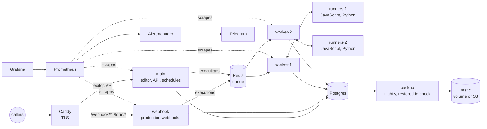

# Production n8n on one machine

Self-hosted n8n that keeps working when its parts fail, says so in Telegram when they do, and can be rebuilt from
its backups. One `docker compose up`: queue mode with separate webhook and worker processes, Code nodes in their own
containers, Postgres, Redis, TLS, Prometheus, Grafana, and nightly backups that are restored before they count.

The default install is one process: the editor, the webhooks, the schedules and every execution share it. A slow
workflow delays the webhooks, a restart drops requests, and the first sign of trouble is a client asking why
nothing happened. This setup splits those jobs apart, watches each of them, and was tested by breaking them.

## Proof

`tools/chaos.py` sends requests through Caddy to a test workflow: a webhook, a JavaScript Code node and a Python
Code node. So each request crosses the queue, a worker and both of its runners, and each answer is checked. Then it
breaks the stack's parts one at a time under that load. When a request fails, the sender sends it again after
5 seconds, as Stripe and most webhook senders would. For the run, Alertmanager's Telegram messages go to a stand-in
that records them. One full run on a laptop (8 cores, 11 GB, a desktop session running alongside):

| Fault | Result |
|---|---|
| None: 20 requests at once | 2021 requests, 6.6 per second, p50 3.0 s, p95 3.5 s, with the laptop's CPU at 100%. One Python task failed to start (HTTP 500) and got through when it was sent again |
| None: one request at a time | p50 393 ms, p95 420 ms |
| `worker-1` restarted | 157 requests, none failed. worker-2 took the new executions, and worker-1 was back after 26 s |
| `worker-1` killed (SIGKILL) | its 5 running executions were lost. Their senders got a 500 after up to 88 s, and all 5 got through when sent again. `ExecutionsLost` reached Telegram after 70 s; the worker was back after 27 s |
| `main` stopped for 2 minutes | 675 webhooks answered, none failed. `TargetDown` reached Telegram after 109 s, and the resolve message followed once `main` was back |
| Redis restarted | back after 6.7 s. 10 executions succeeded, but their senders had no answer within 120 s; sent again, they got through and ran a second time. No execution failed |
| Postgres restarted | back after 6.4 s. 1 request got a 500 and 9 no answer within 120 s; all got through when sent again. One execution stayed "running" in the list |
| Deploy: version 2 pushed with n8nctl, then rolled back | version 2 answered 1.9 s after the push, version 1 1.4 s after the rollback. None of the 93 requests failed, and the live workflow matched git afterwards |
| Restore drill | backup in 10.3 s, restore into an empty Postgres and read in 18.4 s. The restored workflows and decrypted credentials match the live ones by hash |

So a restart that is part of normal work (a worker, `main`, a deploy) costs no requests. A crash or a restart of
Redis or Postgres does cost some, and the sender has to send again: the limits below say what else it costs.

## How it works



**Three kinds of n8n process.** `main` serves the editor and the API and fires schedules and the other triggers.
`webhook` answers production webhooks and forms: Caddy sends `/webhook/*` and `/form/*` there, so requests keep
being answered while `main` restarts or is down. Neither runs workflows. They put executions on the Redis queue,
and `worker-1` and `worker-2` run them, 10 at a time each (`WORKER_CONCURRENCY`). Manual runs from the editor go to
the workers too, so a heavy test does not slow the editor down.

**Code nodes in their own containers.** Each worker hands its Code nodes to a runners container (`n8nio/runners`,
the same version) over a token-authenticated connection. Code there cannot read the worker's files or environment:
the database password and the encryption key the credentials depend on are not in that container.

**Crashes.** A worker that is stopped (a deploy, `docker compose restart`) takes no new executions and finishes
the running ones, for up to 30 seconds; `stop_grace_period` gives it that time. A worker that is killed (out of
memory, SIGKILL) loses the executions it was running. About a minute later, when their lock in Redis runs out, n8n
marks them failed and answers each waiting webhook caller with a 500. It does not run them again, and their input is
gone, so the Retry button in Executions does nothing for them. A sender that retries, as Stripe does, gets its
request through on the next try. The restart policy brings the worker back, and the `ExecutionsLost` alert reports
every loss.

**Queue.** Redis writes the queue to disk every second (AOF), so queued executions survive a Redis restart.
Binary data (files the workflows handle) goes into Postgres, which is n8n's default in queue mode: every process
can read it, and the backups include it.

**Secrets.** `tools/setup.py` generates them into `secrets/` (mode 700, never committed). They reach the
containers as Docker secrets and are read from files (`*_FILE` variables), so `docker inspect` does not show them.
The one exception is the S3 keys for offsite backups, which live in `.env` (mode 600).

**TLS.** Caddy gets a Let's Encrypt certificate for a public `SITE_ADDRESS`. For `localhost` it uses its own
certificate authority, and `setup.py` gives its root certificate to n8nctl, so no tool runs with verification
off. n8n's `/metrics` endpoint is not served to the outside.

**Monitoring.** Every 15 seconds Prometheus scrapes each n8n process, Postgres, Redis, the host and the backup
results, and it keeps 30 days. n8n's own metrics miss the executions a dead worker lost, so failed and lost
executions are counted in the database instead (`prometheus/postgres-queries.yml`). The alert rules go through
Alertmanager to Telegram, one line per alert, and one more line when it resolves:

| Alert | Fires when |
|---|---|
| `TargetDown` | an n8n process, an exporter or a monitoring service has not answered for 1 minute |
| `QueueBacklog` | more than 20 executions have waited for a worker for 5 minutes |
| `ExecutionsLost` | in the last 15 minutes a worker died while running executions, or could not save how they ended |
| `ExecutionErrors` | at least 5 executions failed in the last 15 minutes, and they were over 10% of all |
| `PostgresDown`, `RedisDown` | the exporter has not reached it for 1 minute |
| `DiskSpaceLow` | less than 10% of `/` has been free for 10 minutes |
| `BackupFailed` | the last backup failed |
| `BackupMissing` | no backup has succeeded for 26 hours |

Grafana opens on a provisioned dashboard. It shows executions per minute by outcome, p50 and p95 run time, the
queue, event-loop lag, memory and CPU per process, database size and connections, Redis memory, free disk and the
age of the last backup.

**Backups.** Every night at `BACKUP_AT` the backup container dumps the database and takes the encryption key along:
without the key, the credentials in the dump cannot be decrypted. Before the backup counts, the dump is restored
into a scratch Postgres inside the container, and its workflows and credentials are counted against the live
database. Then restic stores it, encrypted and deduplicated, in a volume on this machine or offsite in S3. It keeps
7 daily, 4 weekly and 6 monthly snapshots, and every Sunday it reads back 10% of the stored data. Each run reports
to the Pushgateway, so a failed or missing backup becomes an alert.

**Restore drill.** Only a restore proves a backup. The last step of `chaos.py` restores the latest snapshot the
way a real recovery would: `backup.sh restore` into an empty Postgres. Then it starts n8n there with the restored
key, and compares the workflows and the decrypted credentials with the live instance, by hash.

**Deploys.** Workflows move between instances with `n8nctl.py`, the same tool the
[Stripe → Xero sync](https://github.com/nightloom-dev/n8n-stripe-xero) uses. It can show the `diff` against git,
`push` a release, and `rollback` to the one before. `chaos.py` pushes a new version under load and rolls it back.

## Run it

Needs Docker with Compose v2 and Python 3.10+; the tools use only the standard library. The images take about
4 GB.

```sh
python3 tools/setup.py       # secrets, docker compose up, the n8n owner, a key for n8nctl, the first backup
python3 tools/chaos.py       # about 30 minutes, ends with "chaos: OK"
```

`setup.py` prints the addresses. n8n is at https://localhost:8443; the owner's password is in
`secrets/owner_password` and Grafana's in `secrets/grafana_admin_password`. Grafana (`:3000`), Prometheus (`:9090`)
and Alertmanager (`:9093`) listen on 127.0.0.1 only; on a server, reach them through an SSH tunnel. `setup.py` is
safe to run again: it keeps the secrets, the owner and a working key.

## Going live

1. Point a DNS name at the server and set it in `.env`: `SITE_ADDRESS=n8n.example.com`,
   `PUBLIC_URL=https://n8n.example.com`, `HTTPS_PUBLISH=443`, `HTTP_PUBLISH=80`. Open ports 80 and 443.
2. Telegram: create a bot with @BotFather, put its token into `secrets/telegram_bot_token` and the chat id into
   `TELEGRAM_CHAT_ID` in `.env`.
3. Offsite backups: `RESTIC_REPOSITORY=s3:https://<endpoint>/<bucket>/n8n` and the two keys in `.env`.
4. `python3 tools/setup.py --instance prod --owner-email you@example.com`.
5. Copy `secrets/` and `.env` somewhere safe off the server, such as a password manager. The backups are encrypted
   with `secrets/restic_password`, so without it they cannot be read.

## Operations

**Rebuild after losing the server.** You need a machine with Docker, this repository, the saved `secrets/` and
`.env`, and the offsite repository. Restore first, while the database is still empty, then start everything:

```sh
docker compose run --rm -v "$PWD/restored:/restore" backup restore   # the latest snapshot; `restore <id>` for another
cmp restored/n8n_encryption_key secrets/n8n_encryption_key           # the key the backup was taken with
python3 tools/setup.py --instance prod --owner-email you@example.com
```

If `secrets/n8n_encryption_key` was lost as well, copy it from `restored/` before running `setup.py`.
`restic snapshots` inside the backup container lists what there is to restore.

**Upgrade n8n.** Take a backup, change the version in `compose.yml` (`n8nio/n8n` and `n8nio/runners` must match),
and start again:

```sh
docker compose exec backup backup.sh run
docker compose up -d
```

`main` migrates the database; the other n8n processes wait until it is healthy. The migrations only go forward, so
going back to the old version means restoring that backup.

**More capacity.** Raise `WORKER_CONCURRENCY` in `.env`, or add a worker: copy the `worker-2` and `runners-2` blocks
in `compose.yml` as `worker-3` and `runners-3`, and add `worker-3:5678` to `prometheus/prometheus.yml`. A growing
`QueueBacklog` alert means it is time.

**Test the alerts.** `docker compose exec alertmanager amtool alert add Test summary="test from amtool"
--alertmanager.url=http://localhost:9093` sends a message to the Telegram chat within 30 seconds.

## Limits

- **One machine.** Postgres, Redis and every n8n process share one server, so nothing here is highly available.
  If the server is lost, it is rebuilt from the offsite backup, and whatever changed after that backup is lost.
- **Lost executions stay lost.** n8n does not run an execution again after its worker died. Webhook senders get an
  error and have to send again, so the workflows must tolerate a repeat, as the
  [Stripe → Xero sync](https://github.com/nightloom-dev/n8n-stripe-xero) does. Schedules run again at their next
  time.
- **Redis restarts.** Queued executions survive, but n8n can miss the message that a running one finished. Its
  caller then waits until its own timeout although the execution succeeded, and when it sends again, the workflow
  runs twice. Another reason the workflows must tolerate a repeat.
- **Postgres restarts.** While Postgres is down, webhooks get a 503 or a 500 and senders retry. A worker that
  finishes an execution in those seconds cannot save its result: the caller gets a 200 without the result or no
  answer at all, and the execution stays "running" in the list until n8n's queue recovery marks it crashed, which
  it does every 3 hours. For planned database work, stop the n8n processes first
  (`docker compose stop main webhook worker-1 worker-2`).
- **Python Code nodes cost CPU.** The Python runner starts a new process for every task. In the baseline the
  runners used about 0.9 CPU-seconds per execution, four times as much as the worker. With the CPU at 100%, about
  one Python task in a thousand fails to start and its caller gets a 500; senders that retry get through.
- **Logs** stay in Docker's json-file logs, 30 MB per container. There is no central log store.
- **Grafana, Prometheus and Alertmanager** are reached through an SSH tunnel. There is no single sign-on in front
  of them.

## Commercial support & migration

This stack is built and maintained by [Nightloom Development](https://nightloom-dev.com). We take paid work around it:

- **Install on your server:** DNS and TLS, Telegram alerts, offsite backups, and a restore drill before it goes live.
- **Migration:** from n8n Cloud, a default one-process install or another host. Workflows, credentials and webhook URLs move over, and the switch happens at a time you pick.
- **n8n upgrades:** a backup first, the new version tried on a restored copy, then the switch.
- **Monitoring and backups:** alerts and dashboards for your own workflows, more workers when the queue grows, help when an alert fires.
- **Fixes:** lost executions, a queue that keeps growing, a full disk, a backup that stopped.

The first piece of work is fixed-price, so you can judge it before the rest. After that it's $30/h. We reply within one business day. We don't sell uptime guarantees: this is one machine, see [Limits](#limits).

Email unwinned@nightloom-dev.com with your current setup and what you want to change.

## Files

```
compose.yml               the stack: n8n processes, runners, Postgres, Redis, Caddy, backup, monitoring, drill
Caddyfile                 TLS, and which paths go to the webhook process
.env.example              addresses, ports, backup schedule and target, Telegram chat
backup/                   the backup image: pg_dump, a check restore, restic, metrics
prometheus/               scrape targets and alert rules
alertmanager/             Telegram delivery
grafana/                  data source and dashboard, provisioned
tools/setup.py            first start: secrets, stack, n8n owner, n8nctl key, first backup
tools/chaos.py            the chaos run above
workflows/chaos-echo.json the test workflow, in n8nctl's portable format
n8nctl.py                 pull, diff, push, rollback and credentials between n8n instances
```

## License

MIT
